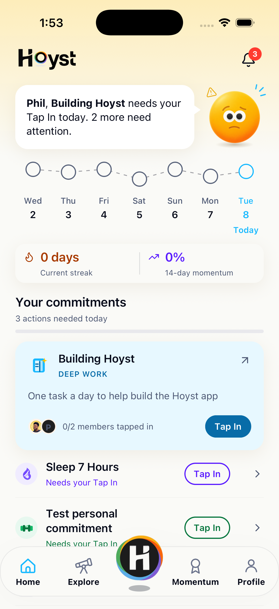
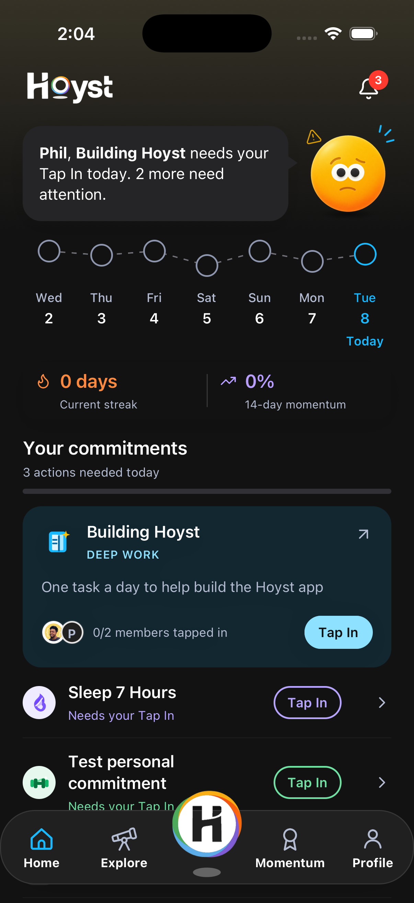
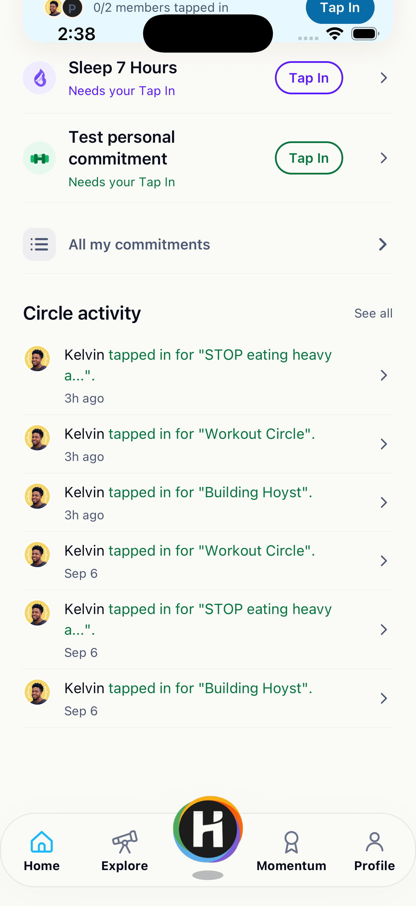
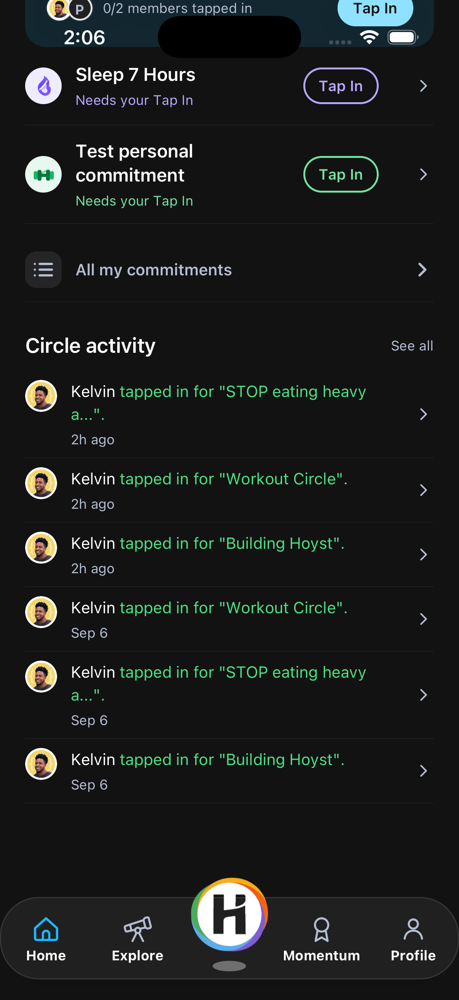

# Approved Home reference

Captured September 8, 2026 from the running iPhone 17 Pro Simulator, iOS 26.5, logical viewport 402 × 874. Source revision: `00d4726793147f6f933886a696ad4530735daa58`. These are real renders, not generated mockups. Personal/live content is incidental to the visual reference and will change with time.

| Light | Dark |
| --- | --- |
|  |  |
|  |  |

`frozen-home-manifest.json` records hashes of existing Home presentation files, legacy design modules/assets and tab-bar presentation. The verification script detects accidental modifications. Hashes establish source stability, not full behavioral or accessibility verification.

## Recent approved refinements

- Reduced header/hero spacing: 22-point page margins, safe-area top +4, preserved 92 × 44 logo, 12-point header-to-hero gap, 8-point hero bottom spacing.
- Smaller centered Hoy: approximately 72-point visible artwork, 68 on narrower layouts; account for image overscan. A darker soft elliptical shadow replaces the hard ground shape.
- Message bubble: 15/20 regular text with selective bold, natural wrapping, padding 16, radius 18, filled tail and warm soft shadow.
- Contextual decorations: 16-point symbols/stars/checks, 20-point rays, slightly outside the upper diagonals with roughly 12-degree tilt. No large framed status badge on Home.
- Getting started: guests, incomplete profiles and pending-only memberships use the smiling Hoy with a pale lavender tint, sparkle and short rays. This approved exception replaces the former locked presentation while preserving each state’s copy and action.
- Today: Hoyst blue on the node, weekday, date and Today label. Preserve the staggered seven-column path and dashed connectors.
- Statistics: 18/22 values, 11/15 captions, 16-point flame and momentum trend icon. Icon/value alignment is centered; captions align with values. Equal columns have 12-point padding beside the centered divider.
- Statistics surface: same color as the canvas, radius 14, padding 12 horizontal/10 vertical, minimum height 56, same shadow as the message bubble. The older filled gray-container plan is superseded.
- Daily progress: the live remaining-action label and thin track sit beneath Your commitments. They measure daily actions, not momentum. The earlier checklist icon design is superseded.
- Focused commitment: category surface with bubble shadow, upper-right northeast details arrow and direct primary action. Current rendered card uses radius 18, horizontal padding 18 and vertical padding 12. Record these as Home-specific values rather than changing them to the reusable default.
- Compact rows: category backplates, wrapping title/status, a separate direct action and right chevron. Row content/chevron expands, rather than submitting an action.
- All my commitments: gray backplate, aligned title column, chevron and dividers.
- Circle activity: compact full-crop image/message/timestamp/chevron rows, with existing media and destinations retained. Existing membership/status ring components elsewhere keep their meaning.
- Existing tab bar: unchanged. Scrolling content must clear it.

## Specialist patterns

| Hoy state | Tint family | Decoration |
| --- | --- | --- |
| Getting started | Lavender | Smiling Hoy, sparkle and short rays |
| Thinking | Lavender | Thought dots |
| Building momentum | Lavender | Star and gentle rays |
| Strong momentum | Blue | Star and upward rays |
| Peak momentum | Mint | Star/completion accent |
| Celebrating | Mint | Brief burst, existing one-shot confetti |
| Momentum needs attention | Pale yellow | Warning and attention rays |
| Deadline approaching | Pale peach | Clock and attention rays |

These treatments come from Hoy's resolved state, not separate decorative state. Dark mode uses restrained color over charcoal. Keep the existing expressions, Reduce Motion handling and celebration lifecycle. Do not put Hoy, tint washes, speech tails or a week path on every screen.

Home contains its own guest, incomplete-profile, loading/error/empty, pending, complete and refresh presentations. They remain unchanged. The gallery demonstrates reusable state treatments, not a replacement implementation of Home's state machine. Only the current attention-state Home was freshly captured for this artifact; this delivery does not claim a fresh render of every Hoy state.

The compact system's screen-title and form roles extend the Home vocabulary for future screens. Existing historical files `docs/home-compact-validation.md`, `docs/home-redesign-validation.md` and root `design-qa.md` are retained as history. Their superseded visual values must not override this reference.
