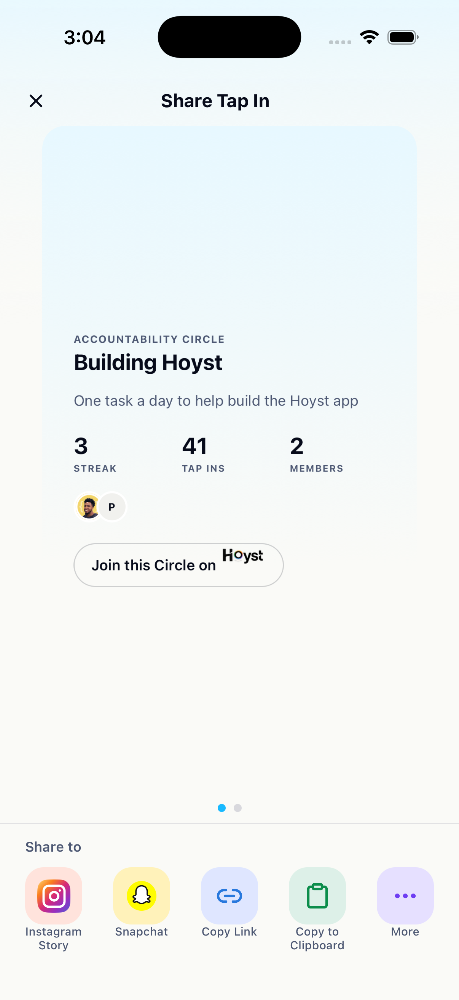
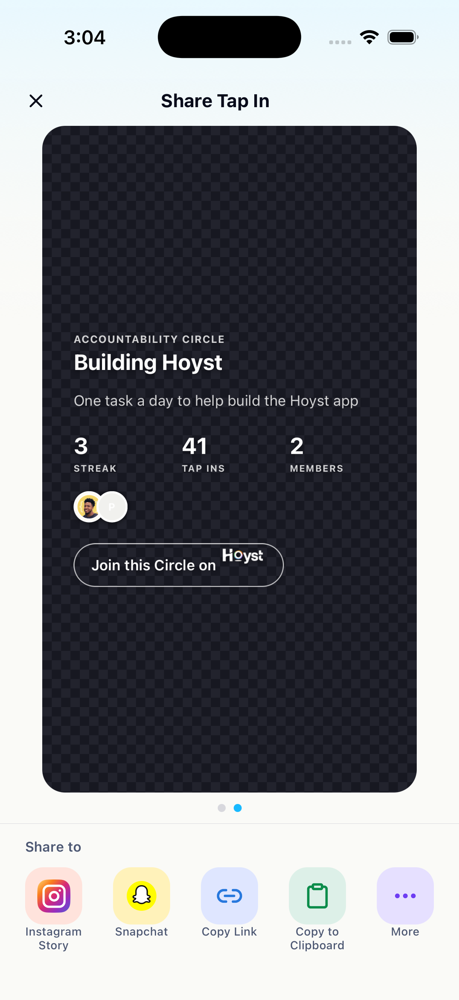
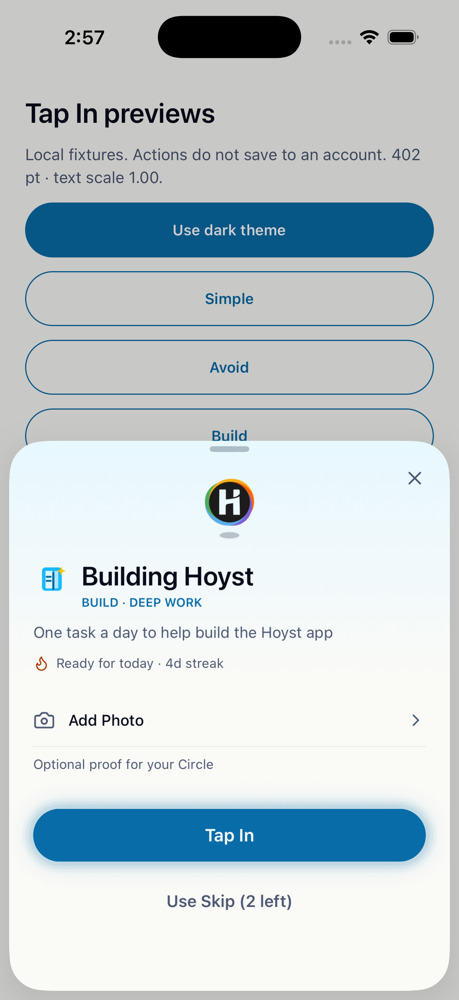
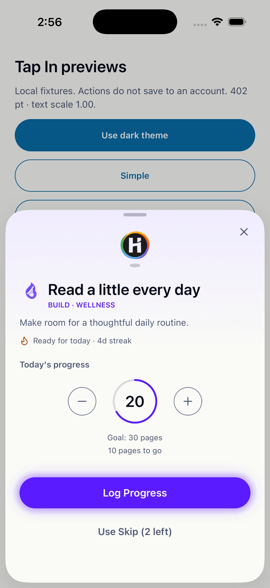
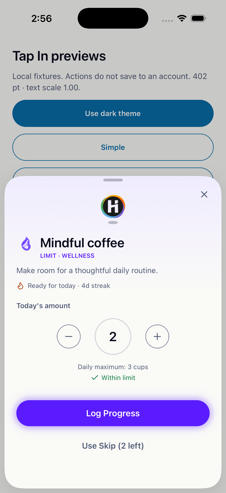
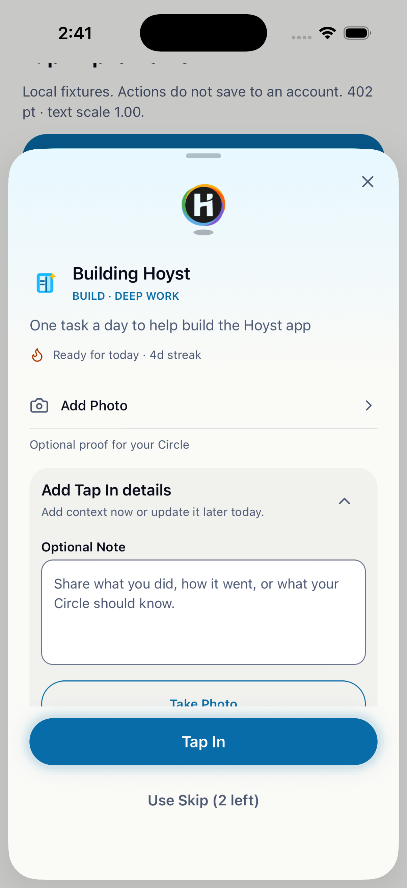
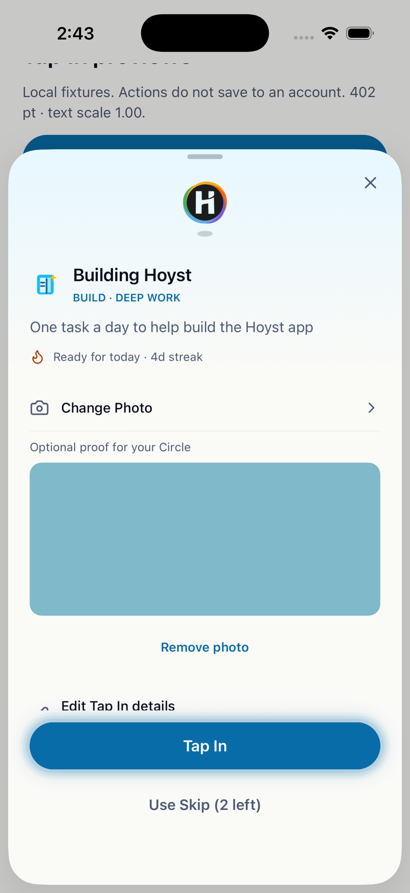
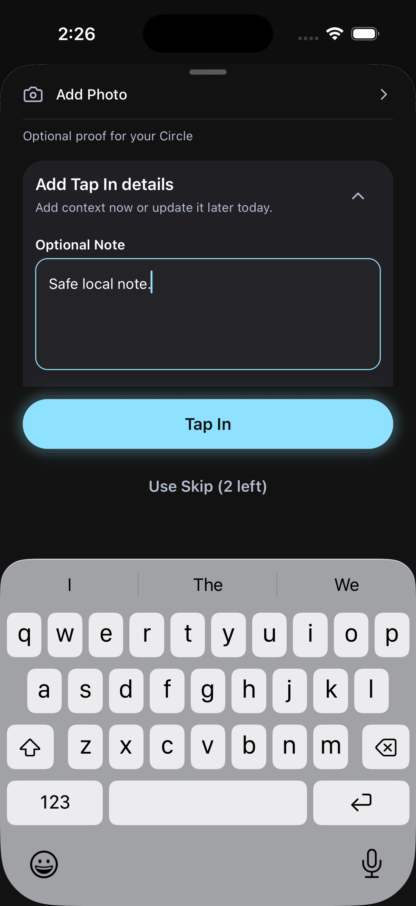
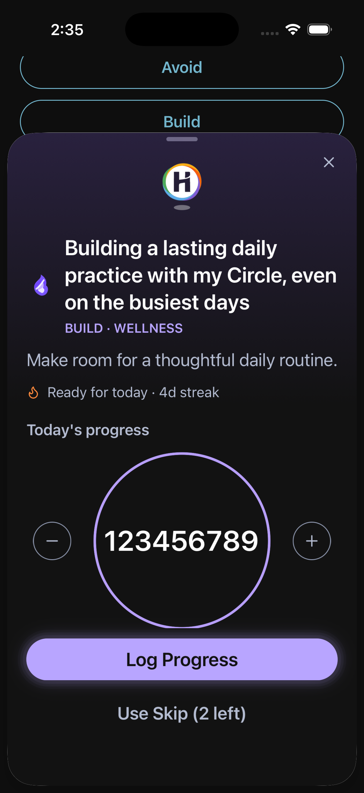
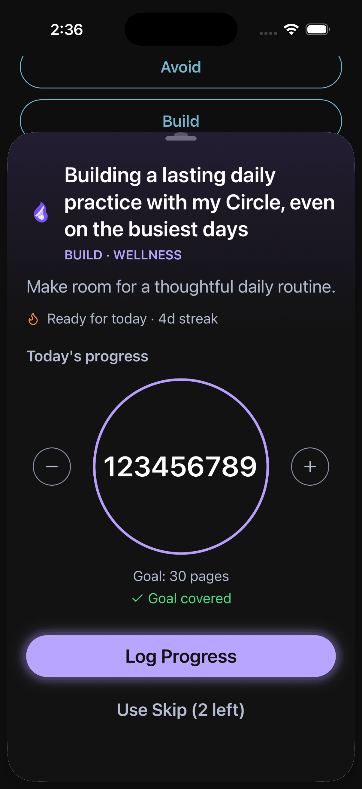

# Tap In composer

Implemented September 9, 2026. This is a local Tap In adoption of the Home design guide. Home, its shared defaults, the floating mark implementation, the tab bar and picker remain unchanged.

## Approved hierarchy

The latest user review supersedes the initial 44-point mark and 16-point commitment title. The commitment context now leads the supporting controls.

| Element                         | Final treatment                                                                                                                                                              |
| ------------------------------- | ---------------------------------------------------------------------------------------------------------------------------------------------------------------------------- |
| Floating Hoyst mark             | 52 points; 32 points above, 16 below; existing oval shadow, movement and Reduce Motion behavior                                                                              |
| Commitment title                | Circle Detail `screenTitle` role: 24/29, semibold; natural wrapping                                                                                                          |
| Description                     | Circle Detail body role: 14/20, regular, muted                                                                                                                               |
| Category                        | Existing 11/15 semibold role and category artwork; category name first in its accent, then muted ` · BUILD` or ` · LIMIT`; no card boundary                                  |
| Status and streak               | Circle Detail inline-attribute 12/16 scale, with a 15-point icon and 6-point gap; wrapping; warning and success retain their meanings                                        |
| Add Photo and collapsed details | 14/20, medium; 12/16 supporting copy; one accessible row target                                                                                                              |
| Expanded details title          | 16/21 semibold; below the commitment title in the hierarchy                                                                                                                  |
| Primary action                  | 16/21 semibold label, minimum 48-point face                                                                                                                                  |
| Skip                            | Full-width target, minimum 56 points; 15/20 muted semibold label                                                                                                             |
| Layout                          | 22-point gutters, Circle Detail hero's 10-point identity/content rhythm, measured content height, and a docked action footer with at least 20 points of iOS bottom clearance |

`DSButton.labelStyle` is an additive, optional override used by the composer primary action. No shared typography or button visual default was retuned.

## Category fade and action glow

The sheet uses the existing appearance preference through a local `DesignSystemProvider`: warm white `#FAFAF7` or charcoal `#121212`. A measured SVG gradient fills the header edge to edge, starting at the category surface behind the logo and ending at the neutral canvas at the bottom of the status row. Controls sit below the fade. Existing category classification and artwork remain authoritative.

The primary face uses the existing paired category action colors. Light mode has white text on the darker category fill; dark mode has charcoal text on the lighter category fill. The glow is confined to three soft layers extending 4, 7 and 10 points around the button, plus its shadow. A 3.1-second opacity cycle uses the native animation driver. It stops when the screen or app is inactive, stays static under Reduce Motion and disappears while disabled or submitting. This treatment is local to the composer and does not alter Home's Tap In button.

## Quantity, saved proof and editing

The ring starts at 72 points and grows for native text scaling, measured text and large values. Neutral minus/plus controls retain their native accessible targets. Existing configured increments, integer rounding, zero floor and submission rules remain in the controller.

Build uses a bounded purple arc with remaining quantity or **Goal covered**. Limit uses an unfilled ring and explicit **Daily maximum** or **Allowed range** guidance. **Within limit**, **Within range**, **Below range**, **Above range** and **Above limit** communicate compliance in words. An out-of-range value remains loggable. Saved feedback follows compliance instead of replacing it.

Photos use a compact Add Photo row, then a preview and removal control. Saved/skipped information, sharing, removal, loading and unavailable feedback use neutral surfaces and semantic actions. `TapInDetailsSection` accepts optional `presentation="composer"` and `category`; its default remains `legacy`. Existing note/photo state, upload retry, save callbacks and unsaved-change handling remain intact. Duplicate submission and details-save guards prevent repeated in-flight calls.

### Saved review and inline editing

The saved Tap In review uses one message surface for proof, then compact utility rows for details, sharing and removal. The proof title uses 16/21, its saved status is semantic success text, and the note stays 14/20. Sharing is a neutral icon row. Removal is a separate quiet danger row with the existing native confirmation.

Opening details keeps the editor in the same vertical flow instead of placing it in a second muted card. It has the 16/21 editor title, 12/16 supporting copy, native-scaling note input, one Add photo or Change photo source row, preview/removal controls and one category primary Save Details button only when there are unsaved changes. It resets the composer body to the header on editor transitions; keyboard focus still scrolls the note into view. These are composer-local presentation rules, not new global defaults.

## Tap In completion

Completion is a local exception that keeps the one-shot celebration as the first visual event. It uses the same warm-white or charcoal canvas, edge-to-edge category fade and inline Circle context as the composer. The `Tap In complete` heading is 26/31, just above the Circle title's 24/29 `screenTitle` role. Category and type use 11/15, commitment copy uses 14/20, and the completion status uses the compact 12/16 inline-attribute role. The category name is first in its category color; ` · BUILD`, ` · LIMIT` and ` · AVOID` remain muted. The large 112-point floating mark, oval shadow and halo retain their motion behavior.

Ordinary Tap Ins and covered Build goals receive the particle celebration. Partial Build progress, outside-range Limit results and skips retain the same hierarchy with outcome-specific text and a calm mark, without particles. The completion title block sits 8 points closer to the mark. The completion body scrolls independently from a safe-area dock containing the equal-height purple **Share as story** action and dark **Done** action. Their local 16/21 semibold labels avoid the legacy button's extra-bold treatment. The shared inline details editor keeps its existing save, photo retry, dirty-state and navigation guards. These treatments are local to completion and do not change route, backend, model or design-system interfaces.

## Tap In Story Share

Story Share is a local continuation of the same system. Its warm-white or charcoal shell has a category fade, 22-point gutters, compact native header and a fixed safe-area share tray. It keeps exactly two 9:16 exports: the adaptive **Tap In moment** card and the complete **Transparent overlay**. A saved proof image fills the adaptive card when available; otherwise the current Circle category backplate fades to the neutral canvas. The transparent card only receives its checkerboard in the in-app preview, never in native capture.

Both exports center a muted 10/14 uppercase **ACCOUNTABILITY CIRCLE** eyebrow, paired with its Circle title using the same 2-point rhythm as the story stats, commitment copy, personal **Streak** and **Tap Ins**, Circle member count, up to three non-pending member previews with a `+N` remainder and the call to action as one compact group. They have no internal header, category identity metadata or member-cluster label. The CTA reads **Join this Circle on** followed by an 18-point text-based Hoyst wordmark rendered inline on the same native text line, with its bottom preserved against the CTA text. The actual invite URL remains in the existing destination text payload. Story Share subscribes locally to Circle detail when authenticated, while route data remains the immediate fallback. The share destinations and capture flow remain unchanged.

| Adaptive primary                                                             | Transparent overlay preview                                                          |
| ---------------------------------------------------------------------------- | ------------------------------------------------------------------------------------ |
|  |  |

## Native sheet layout

Body and footer are measured independently. The compact stop fits their combined height, including bottom safe-area clearance once, between 30% and 92%; the expanded stop remains 92%. Oversized content uses the expanded stop and scrolls above the docked footer. Stable native detent events preserve a user's expanded selection when content changes.

The native wrapper deliberately prevents Screens 4.10 from coercing the first descendant ScrollView to the entire sheet height. Keyboard overlap is measured in the native modal coordinate space, and the focused input scrolls above the docked actions. Native dismissal, grabber, rounded corners and controller discard prompts remain in place.

## Screenshots

These are native iOS fixture captures at 402-point width, not generated mockups. The fixtures use production presentation components with local state and do not submit to an account.

| Simple                                             | Build                                            | Limit                                            |
| -------------------------------------------------- | ------------------------------------------------ | ------------------------------------------------ |
|  |  |  |

| Editor hierarchy                                   | Selected photo                                   | Dark editor with software keyboard                          |
| -------------------------------------------------- | ------------------------------------------------ | ----------------------------------------------------------- |
|  |  |  |

| Long title and large value at 135% text                       | Scrolled goal feedback with footer fixed                                   |
| ------------------------------------------------------------- | -------------------------------------------------------------------------- |
|  |  |

Open **Tap In previews** from the React Native developer menu in a Debug build. Fixtures cover Simple, Avoid, Build, Limit, range, saved, skipped, photo, editor, loading, error, busy and long content. The host defaults to closed and is development-only. Fixture theme controls are local; the existing floating mark still reads the app's real appearance preference. Match that preference when reviewing its dark asset.

## Validation record

| Check                     | Actual result                                                                                                                                                                                                                                                                      |
| ------------------------- | ---------------------------------------------------------------------------------------------------------------------------------------------------------------------------------------------------------------------------------------------------------------------------------- |
| Completion overhaul       | 21 focused completion and details-editor tests pass, including covered/partial Build, outside-range Limit, Skip, safe dock, saved notes/photos, retry, Share as story, Done and dirty-state guards                                                                                 |
| Focused Jest              | 77 tests pass across seven suites, including composer behavior, quantity boundaries, details retry/dirty state, sheet measurements, duplicate prevention, Reduce Motion, completion regressions and existing design-system controls                                                |
| Saved-review refinement   | 45 tests pass across the four current composer, details, presentation and quantity suites, including editor transitions, the single photo chooser, dirty-only save action, retry, removal and saved-quantity behavior                                                              |
| TypeScript                | `npm run typecheck` passes                                                                                                                                                                                                                                                         |
| Formatting and whitespace | Changed-code Prettier checks and `git diff --check` pass                                                                                                                                                                                                                           |
| Changed-file ESLint       | Zero errors; 17 existing inline-style warnings                                                                                                                                                                                                                                     |
| iOS native                | iPhone 17 Pro, iOS 26.5, 402 points: final Simple/Build/Limit light hierarchy, dark editor/keyboard, native steppers, saved out-of-range feedback, photo selection/removal, content fitting and docked actions inspected                                                           |
| Saved-review iOS          | iPhone 17 Pro, iOS 26.5, 402 points: inspected the saved proof message, utility and danger rows, collapsed/open editor, dirty Save Details action and the existing discard confirmation without saving fixture content                                                             |
| Expanded editing          | Native grabber expansion survives opening and collapsing an oversized details editor; automatic content fitting resumes when the user has not selected expansion                                                                                                                   |
| Enlarged text             | Actual OS text scale 1.35: long title and nine-digit quantity render; body scrolls to goal feedback while actions stay fixed                                                                                                                                                       |
| Android                   | Debug build succeeds and APK installs on the Pixel 10 emulator. Emulator is unavailable to the computer-control surface, so native layout/glow parity is not verified                                                                                                              |
| Frozen reference          | All 81 files match their actual start-of-task SHA-256 hashes. The manifest check still reports only the pre-existing `TapInPulseButton` and `HomeProgress` differences; the baseline was not reset                                                                                 |
| Scope                     | No dependency upgrade, backend/model/route change, deployment or release distribution                                                                                                                                                                                              |
| Story Share redesign      | 22 focused service and screen tests pass for the two-card carousel, adaptive photo data, transparent capture route, local Circle fallback replacement, personal stats and destination/capture guards; iPhone 17 Pro light primary and checkerboard preview captures were inspected |

Full VoiceOver/TalkBack traversal, narrow physical/simulated device width, rotation and Android visual/keyboard/glow parity remain open. Jest accessibility props and an inspected native accessibility tree do not establish screen-reader completion. Native theme/text-size preferences used for QA were restored to Light and standard Large afterward.

Focused test command, using the existing pnpm layout exception:

```sh
export PATH=/Users/kelvin/.nvm/versions/node/v22.23.2/bin:$PATH
npm test -- --runInBand \
  __tests__/composer-quantity.test.ts \
  __tests__/tap-in-composer-screen.test.tsx \
  __tests__/tap-in-sheet-options.test.ts \
  __tests__/tap-in-details-section.test.tsx \
  __tests__/tap-in-composer-presentation.test.tsx \
  __tests__/tap-in-complete-screen.test.tsx \
  __tests__/design-system.test.tsx \
  --transformIgnorePatterns 'node_modules/(?!\.pnpm/|react-native/|@react-native/|react-native-svg/|lucide-react-native/|react-native-css-interop/)'
npm run typecheck
git diff --check
```
